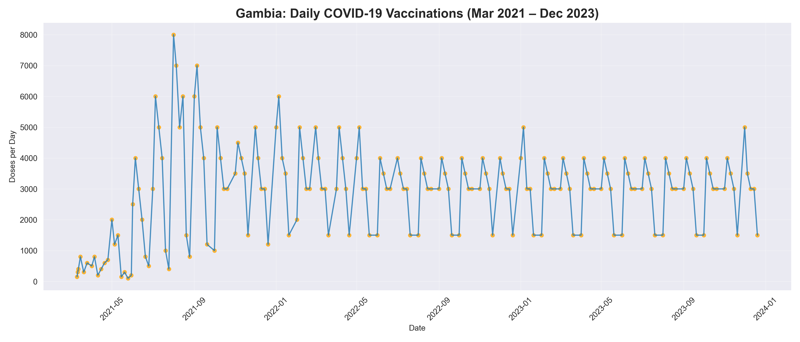
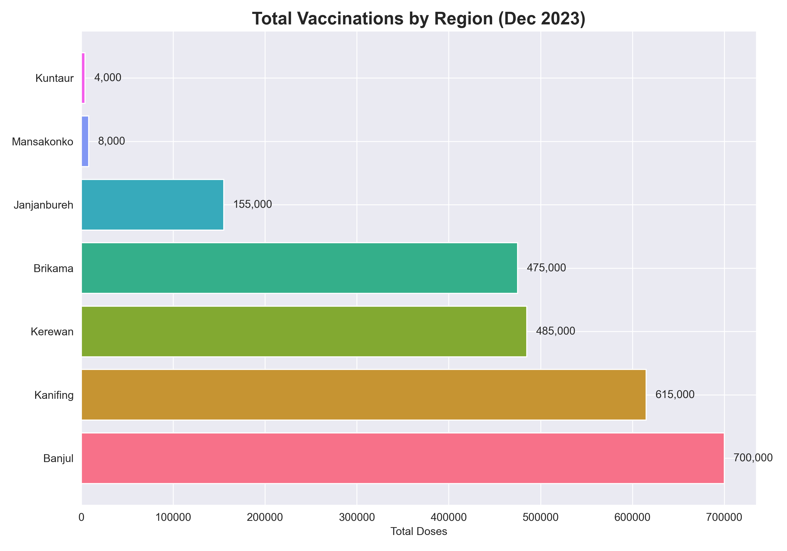

# Gambia COVID-19 Vaccination Analysis (2021–2023)

**Biology & Public Health Report**  
Exploratory analysis of Gambia's COVID-19 vaccination rollout — trends, regional equity, and policy recommendations.

## Key Findings
- ~700,000 total doses administered
- 25.9% estimated population coverage
- Strong urban bias: Banjul & Kanifing received 66% of doses
- Rural regions (Janjanbureh, Kuntaur) significantly lag
- Peak daily rate: ~8,000 doses (August 2021)

## Project Overview
This report analyzes vaccination data across 7 regions to assess:
- Temporal rollout patterns
- Geographic equity
- Biological/public health implications

## Recommendations
- Mobile vaccination units for rural areas
- Community campaigns in local languages
- School & mosque partnerships to build trust

## Notebook
- [Gambia_Vaccination_Analysis.ipynb](Gambia_Vaccination_Analysis.ipynb)

## Data Source
- Derived from Gambia MoH, WHO, and UNICEF reports (2021–2023)

## Tools
- Python (Pandas, Matplotlib, Seaborn)

Built by Omar Gisseh | November 2025  
Email: omar.gisseh8994@gmail.com
